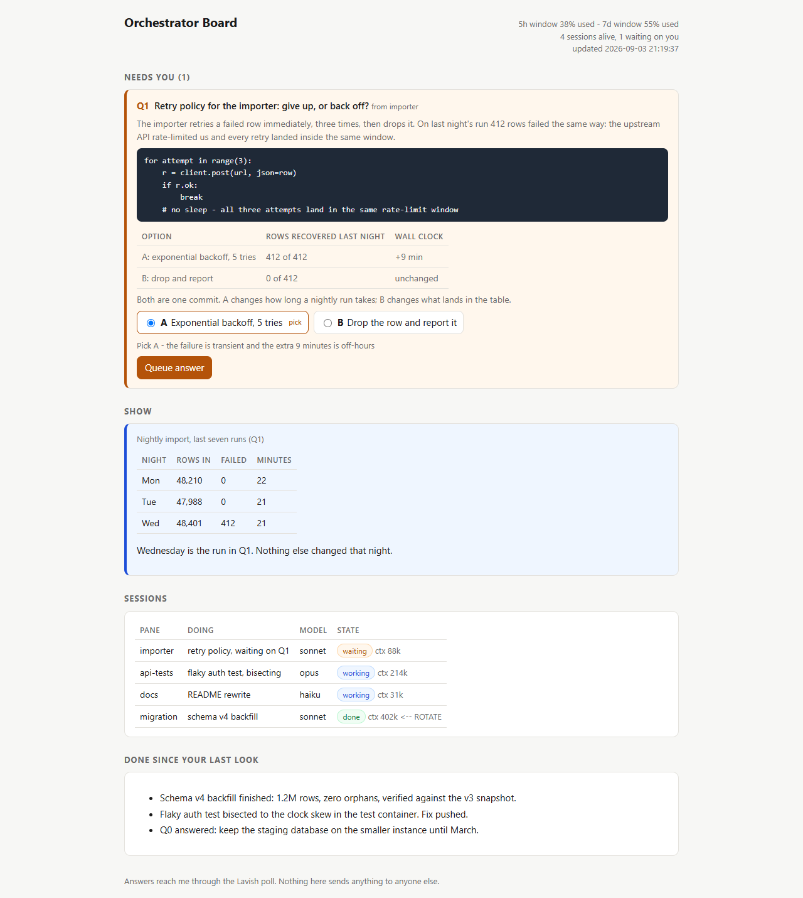

# claude-orchestrate

One Claude Code session that runs all the others.

You talk to one chat. It reads what every other session on the machine is doing, answers their
questions, pushes them along, starts new ones for your new ideas with the right model, retires the
finished ones, and rotates any session that gets too big into a fresh one with a handoff file so
nothing is lost. The questions that genuinely need you land on a single web page - with the actual
code, table or picture attached, not a summary - and your answer goes straight back to the session
that asked.



## Install (5 minutes)

**Windows**

```powershell
git clone https://github.com/RyanCollinsAI/claude-orchestrate.git
cd claude-orchestrate
.\install.ps1 -Cwd C:\path\to\your\project
```

**macOS / Linux**

```bash
git clone https://github.com/RyanCollinsAI/claude-orchestrate.git
cd claude-orchestrate
./install.sh --cwd /path/to/your/project
```

The installer copies the skill to `~/.claude/skills/orchestrate`, writes a `config.json` for your
machine, prints what is installed and what is missing, and asks once before touching your
`settings.json` (it appends, never replaces, and backs the file up first).

Then check it:

```
py  "$HOME/.claude/skills/orchestrate/scripts/orch.py" doctor    # Windows
python3 "$HOME/.claude/skills/orchestrate/scripts/orch.py" doctor
```

And in the Claude Code session you want to be the orchestrator, say: **"be the orchestrator"**.

## What you need

| | | |
|---|---|---|
| **Python 3.11+** | required | Standard library only. No pip installs, ever. |
| **[herdr](https://github.com/anthropics/herdr)** | required | The terminal multiplexer every command drives - `ls`, `spawn`, `rotate`, `reap`, `show`/`hide` all go through it. Without herdr the skill does nothing. |
| **Claude Code** | required | Obviously. `doctor` also shells out to `claude auth status`. |
| **`lavish-axi`** | optional | Only `board open` and `board_watch.py` need it. Every other command works without it; you just read Podium as a local HTML file instead of getting answers back automatically. |
| **`pwsh`** | optional | Only if you point `accounts_tool` at a PowerShell script that switches logins. Off by default. |

Windows first - that is where it was built and proven - but paths go through `os.path`, and process
kills pick `Stop-Process` or `kill` by platform.

## The commands

```
orch.py ls                          every live session: name, status, ctx, model, pane, why it stopped
orch.py spawn <label> "<prompt>"    new pane -> claude in bypass -> prompt sent
orch.py task <label> --goal ... --done ...
                                    write a task file and spawn a session on it
orch.py rotate <name>               ask for a handoff, verify it, spawn the replacement, close the old
orch.py rotate-self                 rotate the orchestrator's own seat; Podium carries over whole
orch.py resume                      re-arm everything after the orchestrator's process restarted
orch.py doctor                      one red/green line per moving part
orch.py show <name> / hide <name>   pull a pane next to you so you can type into it, then send it back
orch.py chrome take|free|who        the single-driver lock on the shared browser
orch.py reap [--hours 6]            close sessions that finished clean and went quiet
orch.py board <...>                 Podium (see board.py --help)
```

Two `Monitor` scripts run in the background and speak only when something needs you:
`watch_sessions.py` (a session asked a question, hit an error, got blocked, drifted out of bypass,
went stale, or grew past the rotate threshold) and `board_watch.py` (you answered something on the
board).

## Why each piece exists

Nothing here is speculative. Every command is a scar:

- **`rotate`** - a session at 400k tokens gets slow and sloppy. `/compact` sent as a message does
  nothing. So the session writes its own handoff, and a fresh one reads it and carries on. Proven
  end to end: a session wrote two of three files, rotated, and the replacement finished the third
  from the handoff alone.
- **`rotate-self`** - the orchestrator cannot ask itself for a handoff; it would be waiting on its
  own turn. So Podium *is* the handoff - `state.json` is durable and gets copied in whole.
- **`resume`** - the orchestrator's own process restarts (auto-updates, a mux restart). Four times
  in one day. Each time the Monitors, Podium's read, and every mid-task builder were silently on
  their own. One command re-arms all of it and names what needs a nudge.
- **`doctor`** - a usage ledger that says "100% headroom, seen never" means nothing was measured,
  not that the account is fresh. Reading *remaining* percent as *used* percent cost a day.
- **`chrome take/free`** - two sessions drove the same browser at once and one typed over the
  other's half-written draft. A lock file both sides can see beats a message someone has to
  remember to send.
- **The BLOCKED classifier** - when a session is stopped by the permission classifier it needs one
  exact command pasted by a human. The watcher pulls that command out of the session's own message
  and puts it on Podium, ready to copy.
- **Panes, not subagents** - anything that has to outlive one turn is a pane. In-process subagents
  are children of the orchestrator's process and die with every restart.
- **The hook** - five command shapes park a pane on a permission prompt or silently lose work
  (heredocs in the Bash tool, `cd X && ...`, `git checkout --`, `git restore`, a backtick inside
  `git commit -m`). A prose rule gets skipped about one run in thirty. A hook never does. The
  installer offers it; `hooks/block-known-traps.py` is short enough to read before you say yes.

## Configuration

`config.example.json` documents every key. All of them are optional - with no `config.json` at all
the defaults come from `~/.claude` and the current directory.

| Key | Default | What it does |
|---|---|---|
| `default_cwd` | the current directory | Where new sessions start, and which project's logs Podium reads. |
| `session_prefix` | basename of `default_cwd`, lowercased | How Claude Code names sessions here. |
| `orchestrator_tab` | `orchestrator` | The herdr tab label that marks the orchestrator's own pane. |
| `accounts_tool` | *(empty - feature off)* | A script printing an OAuth token: `<tool> token <name>`. |
| `rotate_at_k` | `400` | Context size, in thousands of tokens, that marks a session for rotation. |
| `digest_repos` | `[]` | Repos `board digest` reads the morning's commits from. |
| `projects_dir`, `sessions_dir`, `handoffs_dir`, `board_dir` | under `~/.claude` | Override only if your layout is unusual. |

Any key can be overridden for one run with an environment variable: `ORCH_DEFAULT_CWD`,
`ORCH_ROTATE_AT_K`, and so on.

The log directory is derived, not stored: Claude Code writes a project's logs to
`~/.claude/projects/<cwd with every `:`, `\` and `/` turned into `-`>`, and `orchlib.project_slug()`
computes exactly that from `default_cwd`.

## Try Podium with no real data

```
cp  ~/.claude/skills/orchestrate/board/demo-state.json ~/.claude/skills/orchestrate/board/state.json
py  ~/.claude/skills/orchestrate/scripts/board.py render
```

Open the `board.html` it prints. That is the screenshot at the top of this page.

## What it does not do

- It does not run without herdr.
- It does not install any Python package, call any API of its own, or send anything anywhere. The
  only network call in the whole repo is `doctor`'s ping.
- It does not manage cost or billing. Model choice is a judgement call the orchestrator makes and
  reports.
- Account switching ships off. Point `accounts_tool` at your own script if you want it.

## Layout

```
README.md
install.ps1 / install.sh     copy the skill, write config.json, check deps, offer the settings edits
config.example.json          every key, documented
hooks/block-known-traps.py   the PreToolUse hook the installer offers
tools/                       two small helpers the shell installer calls
skills/orchestrate/
  SKILL.md                   what the orchestrating session actually reads
  scripts/                   orch.py, orchlib.py, board.py, the two Monitors, four small utilities
  templates/                 the handoff and task files
  board/                     schema.md and a demo state to render
docs/board.png
CHANGELOG.md
```

## License

MIT. See LICENSE.
